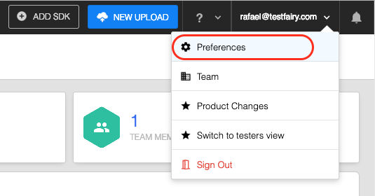

<!-- #   Preferences -->

On the **Preferences** page you can do the following: change your password, customize your account timezone and session duration, integrate your bug system and get your **API Key** and **App Token**. You can reach this page via the dropdown menu on the top right corner of your dashboard.

<!--  -->

To use the TestFairy API to directly upload builds and invite testers, use the **Upload API Key**.

For more information please read the [Upload API](http://docs.testfairy.com/Upload_API.html) guide.

You may also find your **App Token** here for initializing the TestFairy SDK for iOS.

**Adding and Managing Users**

Use the Team screen to manage your teams members:

There are 3 levels of users in the system:
1. **Owner**  - the owner of the account. This user cannot be changed and has full control on the account and can add admins and testers.

2. **Developer**
 - Admin level - a developer that can upload builds, delete builds, view and delete sessions and so on. 
    * by default an admin has `rw` access (read, write) on All projects. This can be changed to read only level (r),  and can be specific to each application.
 - Super admin level - on top of admin abilities can add other admins to the account.
3. **Tester** - see https://docs.testfairy.com/Getting_Started/How_To_Invite_Testers.html

You can add more admins to your projects by adding their email address and specifying the access level in the Permissions field below. 

<!--  -->

- The default access level is All Projects (rw). This level can be changes in the Permissions field.
- If you want a different set of permissions select them from the combinations in the permission windows by clicking on the desired set for each project.

**What to read next:**  [How To Connect To Your Bug System](How_To_Connect_To_Your_Bug_System.html)
 
