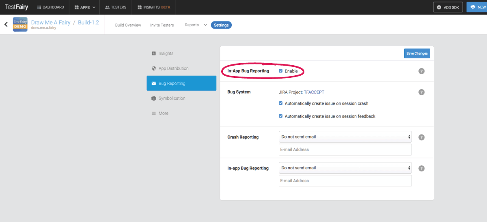

# Connect TestFairy to your Bug Tracking software
Before we start, make sure to connect TestFairy to your bug tracking account:

- [Connect TestFairy to JIRA Cloud](https://docs.testfairy.com/Bug_Tracking/JIRA_Cloud.html)
- [Connect TestFairy to JIRA Server](https://docs.testfairy.com/Bug_Tracking/JIRA_Server.html)
- [Connect TestFairy to TFS](https://docs.testfairy.com/Bug_Tracking/TFS.html)
- [Connect TestFairy to Github](https://docs.testfairy.com/Bug_Tracking/Github.html)
- [Connect TestFairy to Trello](https://docs.testfairy.com/Bug_Tracking/Trello.html)
- [Connect TestFairy to Bugzilla](https://docs.testfairy.com/Bug_Tracking/Bugzilla.html)
- [Connect TestFairy to Pivotal](https://docs.testfairy.com/Bug_Tracking/Pivotal.html)

# Shake to Feedback

TestFairy makes feedback as easy and effortless as a simple shake of your device. 

<iframe width="854" height="480" src="https://www.youtube.com/embed/lVlXx01jrU8" frameborder="0" allow="autoplay; encrypted-media" allowfullscreen></iframe>

When using your app with "In-app Feedback" enabled, your users can post comprehensive feedback at any time by shaking their device. 
An email will pop up on screen, ready for filling in a report. It also comes with an attahched screenshot your tester can scribble on.
Once they send this email, a feedback message is sent to all the relevant destinations (such as your developer's dashboard, JIRA, Slack, etc.) along with their input, the video recording of the session and all the data collected throughout it.

# Enabling Shake to Feedback in your Build Settings

- Choose the app and Build in which you'd like to enable Shake to Feedback

- Go to the "Bug Tracking" section and make sure to check the box in "In-app feedback"

